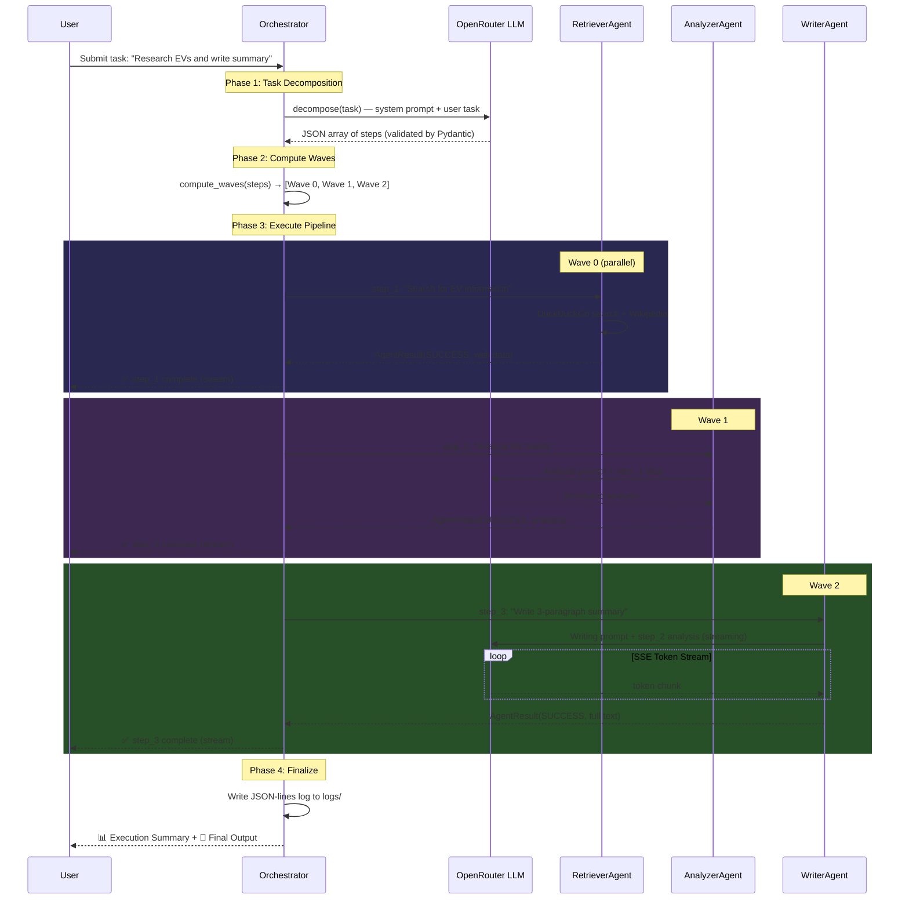
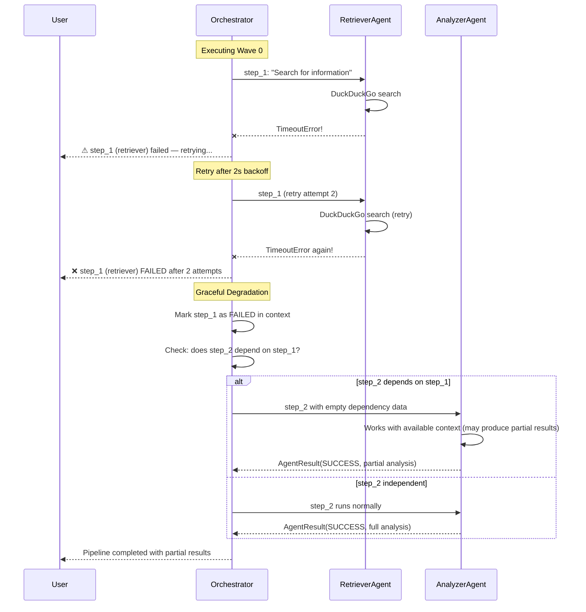
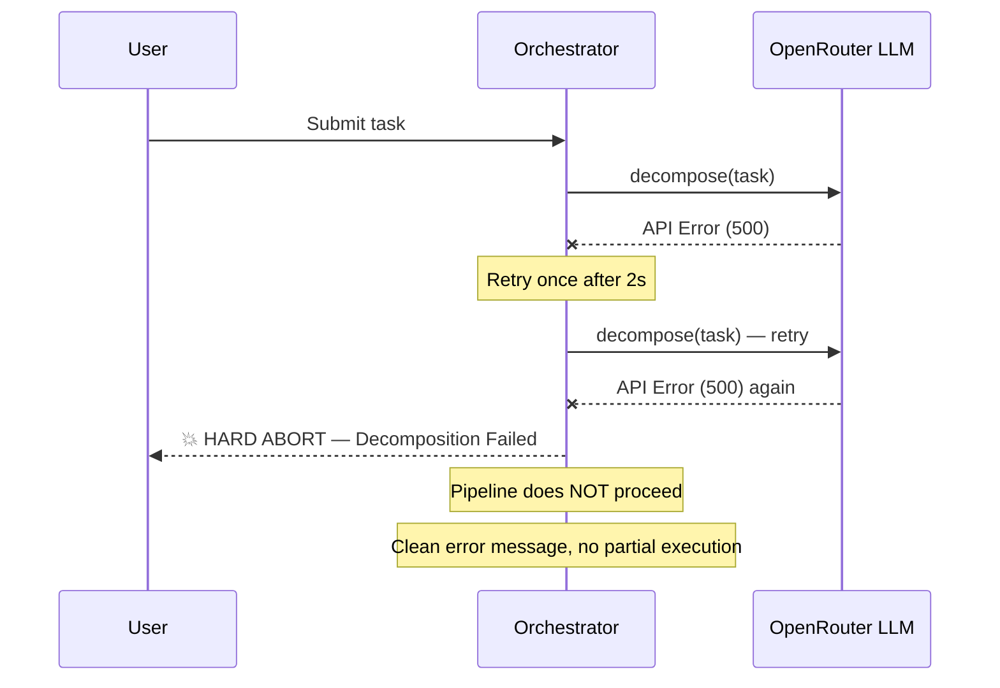

# Sequence Diagram

## Normal Flow: User → Orchestrator → Agents → Streamed Output

```mermaid
sequenceDiagram
    participant U as User
    participant O as Orchestrator
    participant LLM as OpenRouter LLM
    participant R as RetrieverAgent
    participant A as AnalyzerAgent
    participant W as WriterAgent

    U->>O: Submit task: "Research EVs and write summary"

    Note over O: Phase 1: Task Decomposition
    O->>LLM: decompose(task) — system prompt + user task
    LLM-->>O: JSON array of steps (validated by Pydantic)

    Note over O: Phase 2: Compute Waves
    O->>O: compute_waves(steps) → [Wave 0, Wave 1, Wave 2]

    Note over O: Phase 3: Execute Pipeline

    rect rgb(40, 40, 80)
        Note over R: Wave 0 (parallel)
        O->>R: step_1: "Search for EV information"
        R->>R: DuckDuckGo search + Wikipedia
        R-->>O: AgentResult(SUCCESS, web data)
        O-->>U: ✅ step_1 complete (stream)
    end

    rect rgb(60, 40, 80)
        Note over A: Wave 1
        O->>A: step_2: "Analyze EV trends"
        A->>LLM: Analysis prompt + step_1 data
        LLM-->>A: Structured analysis
        A-->>O: AgentResult(SUCCESS, analysis)
        O-->>U: ✅ step_2 complete (stream)
    end

    rect rgb(40, 80, 40)
        Note over W: Wave 2
        O->>W: step_3: "Write 3-paragraph summary"
        W->>LLM: Writing prompt + step_2 analysis (streaming)
        loop SSE Token Stream
            LLM-->>W: token chunk
        end
        W-->>O: AgentResult(SUCCESS, full text)
        O-->>U: ✅ step_3 complete (stream)
    end

    Note over O: Phase 4: Finalize
    O->>O: Write JSON-lines log to logs/
    O-->>U: 📊 Execution Summary + 📝 Final Output
```

## Failure Flow: Retry → Fallback → Continue

```mermaid
sequenceDiagram
    participant U as User
    participant O as Orchestrator
    participant R as RetrieverAgent
    participant A as AnalyzerAgent

    Note over O: Executing Wave 0

    O->>R: step_1: "Search for information"
    R->>R: DuckDuckGo search
    R--xO: TimeoutError!

    O-->>U: ⚠ step_1 (retriever) failed — retrying...

    Note over O: Retry after 2s backoff
    O->>R: step_1 (retry attempt 2)
    R->>R: DuckDuckGo search (retry)
    R--xO: TimeoutError again!

    O-->>U: ❌ step_1 (retriever) FAILED after 2 attempts

    Note over O: Graceful Degradation
    O->>O: Mark step_1 as FAILED in context
    O->>O: Check: does step_2 depend on step_1?

    alt step_2 depends on step_1
        O->>A: step_2 with empty dependency data
        A->>A: Works with available context (may produce partial results)
        A-->>O: AgentResult(SUCCESS, partial analysis)
    else step_2 independent
        O->>A: step_2 runs normally
        A-->>O: AgentResult(SUCCESS, full analysis)
    end

    O-->>U: Pipeline completed with partial results
```

## Decomposition Failure: Hard Abort

```mermaid
sequenceDiagram
    participant U as User
    participant O as Orchestrator
    participant LLM as OpenRouter LLM

    U->>O: Submit task

    O->>LLM: decompose(task)
    LLM--xO: API Error (500)

    Note over O: Retry once after 2s
    O->>LLM: decompose(task) — retry
    LLM--xO: API Error (500) again

    O-->>U: 💥 HARD ABORT — Decomposition Failed
    Note over O: Pipeline does NOT proceed
    Note over O: Clean error message, no partial execution
```
